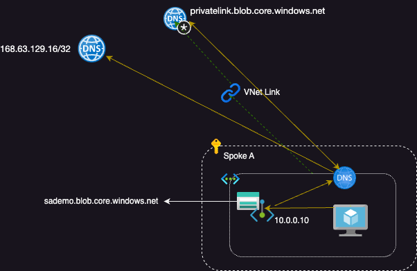

# Azure Private DNS Zones

## Summary
Setup of a single resource group to centralize Azure Private Endpoint private DNS zone values in a Hub and Spoke enterprise model.
>Note: VNets can only be linked to one Private DNS Zone. This is why there are no other branches.

### Simplified View

## Details

For addtional details and usage see, [jameswassinger.com](https://jameswassinger.com)